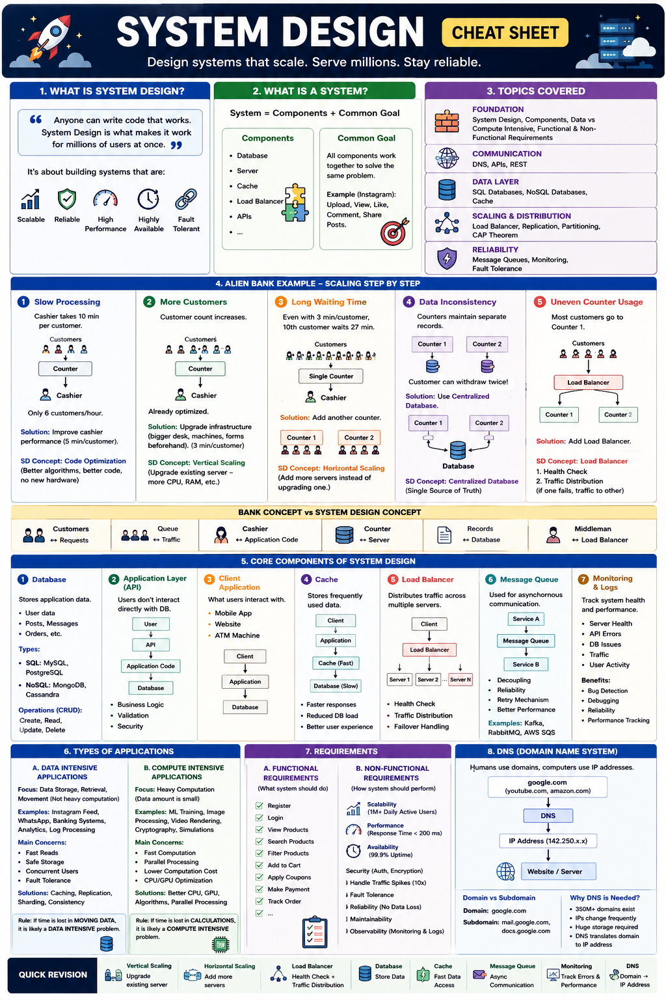

# System Design Notes (Part 1)

## What is System Design?

> "Anyone can write code that works. System Design is what makes it work for millions of users at once."

When we build an application, it may work perfectly for:

- 10 users
- 100 users
- 1000 users

But what happens when **10 million users** use it simultaneously?

System Design focuses on:

- Scalability
- Reliability
- Performance
- Availability
- Fault Tolerance

Examples:

- WhatsApp
- Instagram
- YouTube
- Amazon
- Netflix

---

# What is a System?

A System consists of:

```text
System = Components + Common Goal
```

### Components

Different parts working together:

- Database
- Server
- Cache
- Load Balancer
- APIs

### Common Goal

All components work together to solve the same problem.

Example:

Instagram's goal:

- Upload Posts
- View Posts
- Like Posts
- Comment
- Share Content

---

# Topics Covered in System Design

## Foundation

- What is System Design
- Components of System Design
- Data Intensive Applications
- Compute Intensive Applications
- Functional Requirements
- Non-Functional Requirements

## Communication

- DNS
- APIs
- REST

## Data Layer

- SQL Databases
- NoSQL Databases
- Cache

## Scaling & Distribution

- Load Balancer
- Replication
- Partitioning
- CAP Theorem

## Reliability

- Message Queues
- Monitoring
- Fault Tolerance

---

# Alien Bank Example

The instructor explains System Design using a simple bank.

## Initial Architecture

```text
Customers
    ↓
 Cash Counter
    ↓
  Cashier
```

### Customer Flow

1. Customer visits counter
2. Deposit/Withdraw money
3. Get receipt
4. Leave

---

# Issue 1: Slow Processing

### Problem

Cashier takes:

```text
10 minutes per customer
```

Therefore:

```text
6 customers/hour
```

Only 6 customers are served.

---

## Why is it Slow?

Cashier must:

- Understand customer requirement
- Count cash manually
- Create receipt manually

---

## Solution

Improve cashier performance.

Examples:

- Faster counting
- Faster typing

Result:

```text
10 min → 5 min
```

---

## System Design Concept

### Code Optimization

Equivalent to:

- Better algorithms
- Better DSA
- Better code quality
- Better implementation

Without adding hardware.

---

# Issue 2: Increasing Customers

Customer count grows rapidly.

Cashier is already optimized.

---

## Solution

Upgrade infrastructure.

Examples:

- Bigger desk
- Cash counting machine
- Customer forms before reaching counter

Result:

```text
5 min → 3 min
```

---

## System Design Concept

# Vertical Scaling

Upgrade the existing server.

Examples:

```text
8 GB RAM → 32 GB RAM

4 CPU → 16 CPU
```

Same machine becomes stronger.

---

# Issue 3: Long Waiting Time

Even with:

```text
3 minutes/customer
```

10th customer still waits:

```text
27 minutes
```

because only one counter exists.

---

## Solution

Add another counter.

```text
Counter 1
Counter 2
```

---

## System Design Concept

# Horizontal Scaling

Instead of upgrading one server:

```text
Server 1
Server 2
Server 3
```

Add more servers.

---

# Issue 4: Data Inconsistency

Now we have:

```text
Counter 1
Counter 2
```

Both maintain separate records.

---

## Problem

Customer withdraws money from Counter 1.

Counter 2 doesn't know.

Customer may withdraw again.

---

## Result

Data inconsistency.

---

## Solution

# Centralized Database

```text
Counter 1
    \
     Database
    /
Counter 2
```

Both counters access the same database.

---

## Benefits

- Single Source of Truth
- Consistent Data
- Easier Validation

---

# Issue 5: Uneven Counter Usage

Most customers go to Counter 1.

Counter 2 stays idle.

---

## Problem

```text
Counter 1 → Overloaded

Counter 2 → Underutilized
```

---

## Solution

# Load Balancer

```text
Customers
     ↓
Load Balancer
   /      \
Counter1 Counter2
```

---

## Responsibilities of Load Balancer

### 1. Health Check

Checks:

```text
Is server alive?
Is server down?
```

---

### 2. Traffic Distribution

Example:

```text
Counter1 = 10 customers

Counter2 = 5 customers
```

Next customer goes to Counter2.

---

### If One Server Fails

```text
Counter1 ❌

All traffic → Counter2
```

---

# Mapping Bank Example to System Design

| Bank Concept | System Design Concept |
|-------------|----------------------|
| Customers | Requests |
| Queue | Traffic |
| Cashier | Application Code |
| Counter | Server |
| Records | Database |
| Middleman | Load Balancer |

---

# Core Components of System Design

---

# 1. Database

Stores application data.

Examples:

- User data
- Messages
- Posts
- Orders

---

## Database Operations

CRUD:

```text
Create
Read
Update
Delete
```

---

## Types of Databases

### SQL Databases

Examples:

- MySQL
- PostgreSQL

---

### NoSQL Databases

Examples:

- MongoDB
- Cassandra

---

# 2. Application Layer

Users should never interact directly with the database.

Architecture:

```text
User
 ↓
API
 ↓
Application Code
 ↓
Database
```

---

## Purpose

- Hide database complexity
- Business logic handling
- Security
- Validation

---

## API Endpoints

Examples:

```http
GET /users

GET /products

POST /order

PUT /profile

DELETE /account
```

---

# 3. Client Application

User-facing interface.

Examples:

- Mobile App
- Website
- ATM Machine

Architecture:

```text
Client
  ↓
Application
  ↓
Database
```

---

# 4. Cache

Database calls are expensive.

Store frequently accessed data in memory.

Architecture:

```text
Client
  ↓
Application
  ↓
Cache
  ↓
Database
```

---

## Benefits

- Faster responses
- Reduced DB load
- Better user experience

---

# 5. Load Balancer

Architecture:

```text
Client
   ↓
Load Balancer
   ↓
Servers
```

---

## Responsibilities

### Health Check

Checks whether servers are alive.

### Request Distribution

Distributes traffic evenly.

---

# 6. Message Queue

Used for asynchronous communication.

Example:

Order Placed:

Tasks:

- Update inventory
- Send email
- Send SMS
- Notify vendor

Architecture:

```text
Order Service
      ↓
 Message Queue
      ↓
  SMS Service
```

---

## Benefits

- Decoupling
- Reliability
- Retry Mechanisms
- Better Performance

---

## Examples

- Kafka
- RabbitMQ
- AWS SQS

---

# Synchronous vs Asynchronous

## Synchronous

Wait for response.

```text
Request
   ↓
Response
```

---

## Asynchronous

Don't wait.

```text
Request
   ↓
Queue
   ↓
Continue Working
```

---

# 7. Monitoring & Logs

Large systems require monitoring.

---

## Why?

Monitor:

- Server Health
- API Errors
- Database Failures
- User Activity
- Traffic

---

## Benefits

- Bug Detection
- Debugging
- Reliability
- Performance Tracking

---

# Types of Applications

System Design broadly divides applications into:

```text
1. Data Intensive Applications

2. Compute Intensive Applications
```

---

# Data Intensive Applications

Focus:

```text
Data Storage
Data Retrieval
Data Movement
```

Not heavy calculations.

---

## Examples

- Instagram Feed
- WhatsApp Messages
- Banking Systems
- Analytics Dashboards
- Log Processing

---

## Common Problems

- Slow database queries
- Network delays
- Server bottlenecks

---

## Main Concerns

### Fast Reads

Data should be fetched quickly.

### Safe Storage

Data should never be lost.

### Concurrent Users

Millions of users can access simultaneously.

### Fault Tolerance

Should survive failures.

---

## Solutions

- Caching
- Replication
- Sharding
- Consistency Mechanisms

---

# Instagram Example

Operations:

- Fetch posts
- Sort posts
- Like
- Comment
- Share

Challenge:

```text
Millions of users

Millions of posts
```

---

## How Instagram Scales

### Multiple Databases

Store huge data.

### Aggressive Caching

Fetch data faster.

### CDN

Store images/videos separately.

Database stores only references.

---

## Rule

If time is lost in:

```text
Moving Data
```

Then it is:

# Data Intensive

---

# Compute Intensive Applications

Focus:

```text
Heavy Computation
```

Data volume is smaller.

Processing requirements are huge.

---

## Examples

- Machine Learning Training
- Image Processing
- Video Rendering
- Cryptography
- Simulations

---

## Main Concerns

### Fast Computation

Use better processors.

### Parallel Processing

Multiple computations together.

### Lower Cost

Reduce processing cost.

### GPU Utilization

Use GPU when needed.

---

## Solutions

- Better CPU
- Better GPU
- Better Algorithms
- Parallel Processing

---

# Flight Simulator Example

Goal:

Train pilots safely.

Requirements:

- Realistic physics
- Real-time calculations
- Fast processing

Needs:

```text
CPU
GPU
Algorithms
```

More than databases.

---

# Quick Trick

## Data Intensive

Time lost in:

```text
Data Movement
```

Examples:

- Instagram
- WhatsApp

---

## Compute Intensive

Time lost in:

```text
Calculations
```

Examples:

- AI Training
- Video Rendering

---

# Functional Requirements

Defines:

> What the system should do.

---

## Amazon Example

Features:

- Register
- Login
- View Products
- Search Products
- Filter Products
- Add to Cart
- Apply Coupons
- Make Payment
- Track Order

These are Functional Requirements.

---

# Non-Functional Requirements

Defines:

> How the system should perform.

---

## Amazon Example

### Scalability

```text
1 Million Daily Active Users
```

---

### Performance

```text
Response Time < 200 ms
```

---

### Availability

```text
99.9% Uptime
```

---

### Security

- Authentication
- Authorization
- Encryption

---

### Traffic Spikes

Handle:

```text
10x traffic during sales
```

---

### Fault Tolerance

System should continue working during failures.

---

# Common Non-Functional Requirements

| Requirement | Meaning |
|------------|---------|
| Scalability | Handle growth |
| Availability | System uptime |
| Reliability | No data loss |
| Performance | Fast response |
| Security | Protect data |
| Maintainability | Easy updates |
| Observability | Monitoring & Logging |
| Fault Tolerance | Survive failures |

---

# DNS (Domain Name System)

Humans use:

```text
google.com
youtube.com
amazon.com
```

Computers use:

```text
IP Addresses
```

---

## Purpose of DNS

Convert:

```text
google.com
```

into

```text
IP Address
```

---

## DNS Flow

```text
Browser
   ↓
 DNS
   ↓
 IP Address
   ↓
 Website
```

---

# Domain vs Subdomain

## Domain

```text
google.com
```

---

## Subdomain

```text
mail.google.com

docs.google.com
```

---

# Why Not Store All Domains in Browser?

Because:

- More than 350 million domains exist.
- Storage requirement is huge.
- IP addresses change frequently.

Therefore DNS is required.

---

# Final Revision Sheet

```text
System = Components + Common Goal

Vertical Scaling = Upgrade Existing Server

Horizontal Scaling = Add More Servers

Database = Store Data

API = Access Data

Client = User Interface

Cache = Faster Data Access

Load Balancer =
    Health Check +
    Traffic Distribution

Message Queue =
    Asynchronous Communication

Monitoring =
    Error Tracking +
    Performance Tracking

Data Intensive =
    Data Movement Problem

Compute Intensive =
    Computation Problem

Functional Requirement =
    What System Does

Non-Functional Requirement =
    How System Performs

DNS =
    Domain → IP Address
```"# System-Design-Notes-" 




# System Design Notes (Part 2)

## DNS Architecture, APIs, REST APIs, Databases & SQL

---

# Chapter 13: DNS System Architecture

## What is DNS?

DNS (Domain Name System) converts:

```text
google.com
```

into

```text
IP Address
```

because computers communicate using IP addresses.

---

## DNS Lookup Flow

```text
Browser
   ↓
DNS Resolver
   ↓
Root Server
   ↓
TLD Server
   ↓
Authoritative Name Server
   ↓
IP Address
   ↓
Website
```

---

## DNS Resolver

Usually provided by:

- ISP (Internet Service Provider)
- Router
- Public DNS (Google DNS, Cloudflare DNS)

Responsibility:

```text
Resolve domain names into IP addresses
```

---

## Root Servers

There are:

```text
13 Root Server Groups
```

named:

```text
A → M
```

Root servers do NOT know website IPs.

They only know:

```text
Which TLD Server should be contacted
```

---

## Top Level Domain (TLD)

Examples:

```text
.com
.net
.org
.edu
.gov
.in
.uk
```

TLD servers know:

```text
Which Authoritative Name Server
handles a domain
```

---

## Authoritative Name Server

Stores actual DNS records.

Examples:

- GoDaddy
- Hostinger
- Namecheap

Returns:

```text
Actual IP Address
```

Example:

```text
telesco.com
↓
192.xxx.xxx.xxx
```

---

# DNS Caching

Without caching:

```text
Root Server Call
TLD Call
Authoritative Server Call
```

would happen for every request.

---

## Cache Locations

### Browser Cache

Chrome, Firefox, Edge

---

### OS Cache

Operating System stores DNS records.

---

### DNS Resolver Cache

ISP stores common DNS records.

---

# DNS Zone

A zone contains:

```text
Main Domain
+
All Subdomains
```

Example:

```text
telesco.com
docs.telesco.com
courses.telesco.com
blog.telesco.com
```

All belong to one zone.

---

# DNS Quick Revision

```text
Root Server
   ↓
TLD Server
   ↓
Authoritative Server
   ↓
IP Address
```

---

# Chapter 14: Application Programming Interface (API)

## What is API?

API =

```text
Application Programming Interface
```

API acts as a bridge between applications.

---

## Real World Example

Applications:

- Uber
- Ola
- Rapido
- Zomato
- Swiggy

use:

```text
Google Maps API
```

instead of creating maps themselves.

---

# Why APIs Exist?

Suppose a Movie Application already stores:

- Ratings
- Reviews
- Movies

Another developer wants the same data.

Options:

### Option 1

Build everything again ❌

### Option 2

Use APIs ✅

---

# Why Not Give Database Access?

Problems:

- Data corruption
- Security risks
- Data deletion
- Sensitive information leakage

Architecture:

```text
Database
   ↑
Application
   ↑
API
   ↑
Client
```

---

# API Use Cases

## Application ↔ Application

Example:

```text
Google Maps API
```

---

## Frontend ↔ Backend

Example:

```text
React Frontend
      ↓
REST API
      ↓
Node Backend
```

---

# API Benefits

- Reusability
- Security
- Modularity
- Easy Integration
- Language Independent

---

# Chapter 15: Types of APIs

---

# 1. REST API

REST =

```text
Representational State Transfer
```

Uses:

```text
JSON
```

Advantages:

- Simple
- Lightweight
- Easy Maintenance

---

# 2. SOAP API

SOAP =

```text
Simple Object Access Protocol
```

Uses:

```text
XML
```

Characteristics:

- Heavyweight
- Older Technology
- Used in Legacy Systems

---

# JSON vs XML

## JSON

```json
{
  "name": "Pratik"
}
```

---

## XML

```xml
<user>
   <name>Pratik</name>
</user>
```

---

# 3. GraphQL

GraphQL provides:

```text
Single Endpoint
```

Frontend sends queries.

Example:

```graphql
{
  user {
    name
    email
  }
}
```

Advantages:

- Flexible
- Avoid Over-Fetching
- Single Endpoint

---

# 4. gRPC

gRPC =

```text
Google Remote Procedure Call
```

Uses:

```text
Protocol Buffers
```

instead of:

- JSON
- XML

Advantages:

- Smaller Payload
- Faster Communication
- Low Latency

Used in:

```text
Microservices
```

---

# 5. WebSocket

Used for:

- Chats
- Notifications
- Live Updates
- Real-Time Applications

---

## Traditional API

```text
Request
   ↓
Response
```

---

## WebSocket

```text
Client
  ↔
Server
```

Two-way communication.

Examples:

- WhatsApp
- Messenger
- Live Quizzes
- Trading Apps

---

# API Comparison

| API | Data Format | Best Use |
|------|------------|----------|
| REST | JSON | General APIs |
| SOAP | XML | Legacy Systems |
| GraphQL | Query Based | Flexible Frontend |
| gRPC | Protocol Buffers | Microservices |
| WebSocket | Persistent Connection | Real-Time Apps |

---

# Chapter 16: RESTful APIs

REST =

```text
Representational State Transfer
```

Most used API architecture today.

---

# JSON Basics

Example:

```json
{
  "name": "Pratik",
  "age": 20
}
```

---

## Supported Types

- String
- Number
- Boolean
- Object
- Array
- Null

---

# Endpoint

Endpoint =

```text
Method + Path
```

Example:

```http
GET /users
```

---

# URL Structure

```text
https://mysite.com/api/v1/users
```

Components:

| Part | Meaning |
|--------|---------|
| mysite.com | Domain |
| api | API Layer |
| v1 | Version |
| users | Resource |

---

# HTTP Methods

---

## GET

Retrieve Data

```http
GET /users
```

Returns all users.

---

```http
GET /users/1
```

Returns user with ID 1.

---

## POST

Create Data

```http
POST /users
```

Body:

```json
{
  "name": "Pratik"
}
```

---

## PUT

Replace Entire Record

```http
PUT /users/1
```

Missing fields become:

```text
null/default
```

---

## PATCH

Partial Update

```http
PATCH /users/1
```

Only updates selected fields.

---

## DELETE

Delete Resource

```http
DELETE /users/1
```

Deletes user with ID 1.

---

# PUT vs PATCH

## PUT

Replaces complete record.

Example:

Current Data:

```json
{
  "name": "Pratik",
  "age": 20
}
```

PUT:

```json
{
  "name": "John"
}
```

Result:

```json
{
  "name": "John",
  "age": null
}
```

---

## PATCH

Updates only requested field.

```json
{
  "name": "John"
}
```

Result:

```json
{
  "name": "John",
  "age": 20
}
```

---

# Nested Resources

Entities:

```text
Users
Blogs
Comments
```

---

## Blog Comments

```http
GET /blogs/1/comments
```

---

## User Comments

```http
GET /users/1/comments
```

---

# Nesting vs Filtering

## Use Nesting

When relationship is direct.

Example:

```http
/blogs/1/comments
```

---

## Use Query Parameters

For:

- Filtering
- Sorting
- Searching
- Pagination

Examples:

```http
/products?color=red

/blogs?q=java

/blogs?sort=asc
```

---

# Ways to Send Data

## Path Parameters

Used for:

- IDs
- Slugs

Example:

```http
/users/1
```

---

## Query Parameters

Used for:

- Search
- Filter
- Sort
- Pagination

Example:

```http
/shops?price=1000
```

---

## Request Body

Used for:

- Login
- Signup
- Sensitive Data

Example:

```json
{
  "username":"abc",
  "password":"123"
}
```

---

# Full REST Request Example

```http
POST /api/v3/users
```

Headers:

```http
Content-Type: application/json
```

Body:

```json
{
  "name":"Pratik"
}
```

---

# Chapter 17: RESTful Responses

---

# Important HTTP Status Codes

## 200 OK

Everything worked successfully.

---

## 201 Created

New entity created.

---

## 204 No Content

Success but no response body.

Mostly used with:

```http
DELETE
```

---

## 301 Permanent Redirect

Permanent URL change.

---

## 302 Temporary Redirect

Temporary URL change.

---

## 400 Bad Request

Invalid request data.

---

## 401 Unauthorized

Authentication required.

---

## 403 Forbidden

Access denied.

---

## 404 Not Found

Resource not found.

---

## 500 Internal Server Error

Backend issue.

---

# Status Code Cheat Sheet

| Code | Meaning |
|--------|---------|
| 200 | OK |
| 201 | Created |
| 204 | No Content |
| 301 | Permanent Redirect |
| 302 | Temporary Redirect |
| 400 | Bad Request |
| 401 | Unauthorized |
| 403 | Forbidden |
| 404 | Not Found |
| 500 | Internal Server Error |

---

# Response Best Practice

❌ Avoid

```json
[
 {}
]
```

---

✅ Preferred

```json
{
  "users": [
    {}
  ]
}
```

Benefits:

- Easy Extension
- Cleaner Structure
- Future Flexibility

---

# Chapter 18: Database Introduction

Without Database:

```text
Server Restart
      ↓
Data Lost
```

---

# Why Database?

Stores information permanently.

Examples:

- Users
- Posts
- Orders
- Messages

---

# Types of Databases

## SQL

(Relational Databases)

Examples:

- MySQL
- PostgreSQL

---

## NoSQL

Examples:

- MongoDB
- Cassandra

---

# Chapter 19: Relational Database (SQL)

SQL =

```text
Structured Query Language
```

Stores data using:

```text
Tables
Rows
Columns
```

---

# Table Example

Users Table

| ID | First Name | Last Name | Phone |
|----|------------|------------|--------|
| 1 | Pratik | Naik | 987654321 |

---

# Important Terms

## Table

Collection of records.

---

## Column

Attributes.

Examples:

```text
ID
Name
Phone
```

---

## Row

Complete Record.

Example:

```text
Pratik Naik Record
```

---

# Naming Convention

Use plural names.

✅ Correct

```text
users
posts
comments
videos
```

❌ Avoid

```text
user
post
video
```

---

# Chapter 20: Database Constraints

Constraints ensure valid data.

---

## UNIQUE

No duplicate values allowed.

Example:

```text
username
```

Two users cannot have same username.

---

## NOT NULL

Field cannot be empty.

Example:

```text
first_name
```

---

## PRIMARY KEY

Unique identifier of a row.

Example:

```text
id
```

Properties:

- Unique
- Non-null
- Identifies one record only

---

# Why Primary Key is Important?

Used for:

- Record Identification
- Relationships
- Foreign Keys
- Faster Retrieval

---

# Quick Revision Sheet

```text
DNS:
Root → TLD → Authoritative → IP

API:
Application Communication Layer

REST:
JSON Based APIs

SOAP:
XML Based APIs

GraphQL:
Single Endpoint

gRPC:
Fast Internal Communication

WebSocket:
Real-Time Communication

HTTP Methods:
GET
POST
PUT
PATCH
DELETE

Response Codes:
200
201
204
301
302
400
401
403
404
500

Database:
Permanent Storage

SQL:
Tables + Rows + Columns

Constraints:
UNIQUE
NOT NULL
PRIMARY KEY
```

---
**End of System Design Notes (Part 2)**