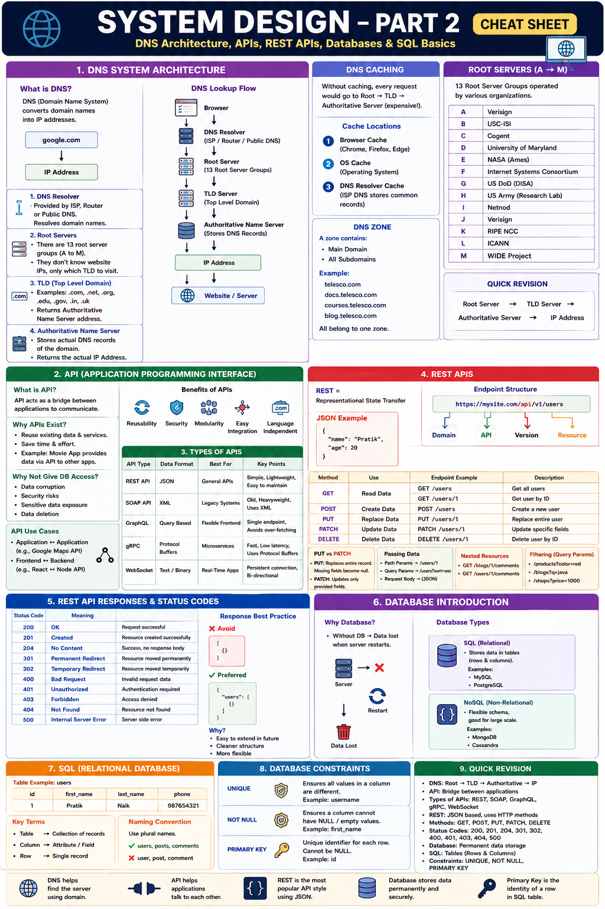
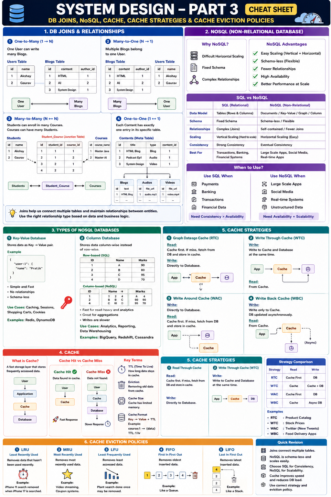
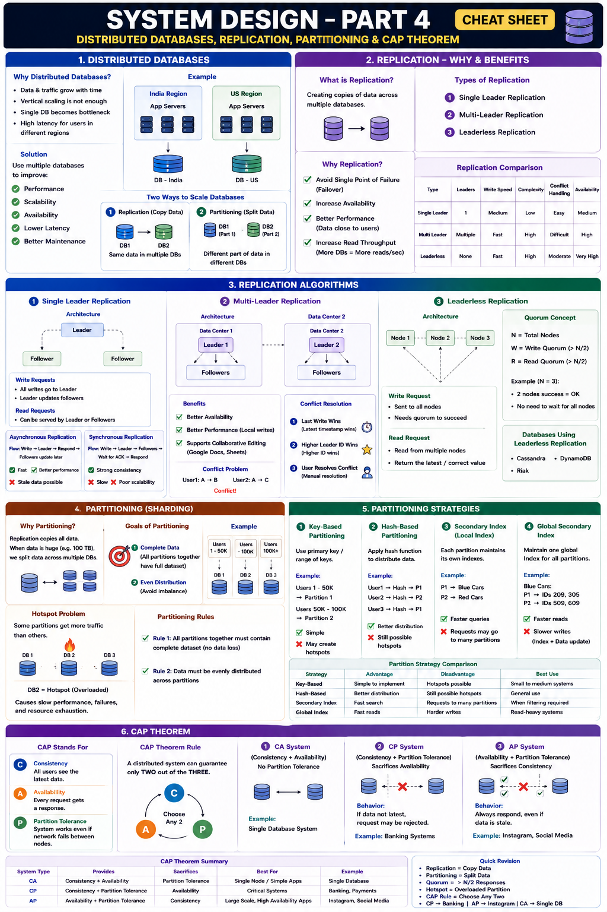
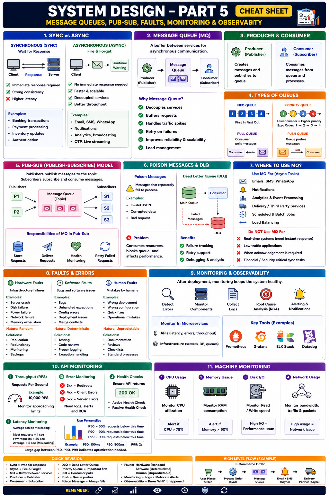

# System Design Notes (Part 1)

## What is System Design?

> "Anyone can write code that works. System Design is what makes it work for millions of users at once."

When we build an application, it may work perfectly for:

- 10 users
- 100 users
- 1000 users

But what happens when **10 million users** use it simultaneously?

System Design focuses on:

- Scalability
- Reliability
- Performance
- Availability
- Fault Tolerance

Examples:

- WhatsApp
- Instagram
- YouTube
- Amazon
- Netflix

---

# What is a System?

A System consists of:

```text
System = Components + Common Goal
```

### Components

Different parts working together:

- Database
- Server
- Cache
- Load Balancer
- APIs

### Common Goal

All components work together to solve the same problem.

Example:

Instagram's goal:

- Upload Posts
- View Posts
- Like Posts
- Comment
- Share Content

---

# Topics Covered in System Design

## Foundation

- What is System Design
- Components of System Design
- Data Intensive Applications
- Compute Intensive Applications
- Functional Requirements
- Non-Functional Requirements

## Communication

- DNS
- APIs
- REST

## Data Layer

- SQL Databases
- NoSQL Databases
- Cache

## Scaling & Distribution

- Load Balancer
- Replication
- Partitioning
- CAP Theorem

## Reliability

- Message Queues
- Monitoring
- Fault Tolerance

---

# Alien Bank Example

The instructor explains System Design using a simple bank.

## Initial Architecture

```text
Customers
    ↓
 Cash Counter
    ↓
  Cashier
```

### Customer Flow

1. Customer visits counter
2. Deposit/Withdraw money
3. Get receipt
4. Leave

---

# Issue 1: Slow Processing

### Problem

Cashier takes:

```text
10 minutes per customer
```

Therefore:

```text
6 customers/hour
```

Only 6 customers are served.

---

## Why is it Slow?

Cashier must:

- Understand customer requirement
- Count cash manually
- Create receipt manually

---

## Solution

Improve cashier performance.

Examples:

- Faster counting
- Faster typing

Result:

```text
10 min → 5 min
```

---

## System Design Concept

### Code Optimization

Equivalent to:

- Better algorithms
- Better DSA
- Better code quality
- Better implementation

Without adding hardware.

---

# Issue 2: Increasing Customers

Customer count grows rapidly.

Cashier is already optimized.

---

## Solution

Upgrade infrastructure.

Examples:

- Bigger desk
- Cash counting machine
- Customer forms before reaching counter

Result:

```text
5 min → 3 min
```

---

## System Design Concept

# Vertical Scaling

Upgrade the existing server.

Examples:

```text
8 GB RAM → 32 GB RAM

4 CPU → 16 CPU
```

Same machine becomes stronger.

---

# Issue 3: Long Waiting Time

Even with:

```text
3 minutes/customer
```

10th customer still waits:

```text
27 minutes
```

because only one counter exists.

---

## Solution

Add another counter.

```text
Counter 1
Counter 2
```

---

## System Design Concept

# Horizontal Scaling

Instead of upgrading one server:

```text
Server 1
Server 2
Server 3
```

Add more servers.

---

# Issue 4: Data Inconsistency

Now we have:

```text
Counter 1
Counter 2
```

Both maintain separate records.

---

## Problem

Customer withdraws money from Counter 1.

Counter 2 doesn't know.

Customer may withdraw again.

---

## Result

Data inconsistency.

---

## Solution

# Centralized Database

```text
Counter 1
    \
     Database
    /
Counter 2
```

Both counters access the same database.

---

## Benefits

- Single Source of Truth
- Consistent Data
- Easier Validation

---

# Issue 5: Uneven Counter Usage

Most customers go to Counter 1.

Counter 2 stays idle.

---

## Problem

```text
Counter 1 → Overloaded

Counter 2 → Underutilized
```

---

## Solution

# Load Balancer

```text
Customers
     ↓
Load Balancer
   /      \
Counter1 Counter2
```

---

## Responsibilities of Load Balancer

### 1. Health Check

Checks:

```text
Is server alive?
Is server down?
```

---

### 2. Traffic Distribution

Example:

```text
Counter1 = 10 customers

Counter2 = 5 customers
```

Next customer goes to Counter2.

---

### If One Server Fails

```text
Counter1 ❌

All traffic → Counter2
```

---

# Mapping Bank Example to System Design

| Bank Concept | System Design Concept |
|-------------|----------------------|
| Customers | Requests |
| Queue | Traffic |
| Cashier | Application Code |
| Counter | Server |
| Records | Database |
| Middleman | Load Balancer |

---

# Core Components of System Design

---

# 1. Database

Stores application data.

Examples:

- User data
- Messages
- Posts
- Orders

---

## Database Operations

CRUD:

```text
Create
Read
Update
Delete
```

---

## Types of Databases

### SQL Databases

Examples:

- MySQL
- PostgreSQL

---

### NoSQL Databases

Examples:

- MongoDB
- Cassandra

---

# 2. Application Layer

Users should never interact directly with the database.

Architecture:

```text
User
 ↓
API
 ↓
Application Code
 ↓
Database
```

---

## Purpose

- Hide database complexity
- Business logic handling
- Security
- Validation

---

## API Endpoints

Examples:

```http
GET /users

GET /products

POST /order

PUT /profile

DELETE /account
```

---

# 3. Client Application

User-facing interface.

Examples:

- Mobile App
- Website
- ATM Machine

Architecture:

```text
Client
  ↓
Application
  ↓
Database
```

---

# 4. Cache

Database calls are expensive.

Store frequently accessed data in memory.

Architecture:

```text
Client
  ↓
Application
  ↓
Cache
  ↓
Database
```

---

## Benefits

- Faster responses
- Reduced DB load
- Better user experience

---

# 5. Load Balancer

Architecture:

```text
Client
   ↓
Load Balancer
   ↓
Servers
```

---

## Responsibilities

### Health Check

Checks whether servers are alive.

### Request Distribution

Distributes traffic evenly.

---

# 6. Message Queue

Used for asynchronous communication.

Example:

Order Placed:

Tasks:

- Update inventory
- Send email
- Send SMS
- Notify vendor

Architecture:

```text
Order Service
      ↓
 Message Queue
      ↓
  SMS Service
```

---

## Benefits

- Decoupling
- Reliability
- Retry Mechanisms
- Better Performance

---

## Examples

- Kafka
- RabbitMQ
- AWS SQS

---

# Synchronous vs Asynchronous

## Synchronous

Wait for response.

```text
Request
   ↓
Response
```

---

## Asynchronous

Don't wait.

```text
Request
   ↓
Queue
   ↓
Continue Working
```

---

# 7. Monitoring & Logs

Large systems require monitoring.

---

## Why?

Monitor:

- Server Health
- API Errors
- Database Failures
- User Activity
- Traffic

---

## Benefits

- Bug Detection
- Debugging
- Reliability
- Performance Tracking

---

# Types of Applications

System Design broadly divides applications into:

```text
1. Data Intensive Applications

2. Compute Intensive Applications
```

---

# Data Intensive Applications

Focus:

```text
Data Storage
Data Retrieval
Data Movement
```

Not heavy calculations.

---

## Examples

- Instagram Feed
- WhatsApp Messages
- Banking Systems
- Analytics Dashboards
- Log Processing

---

## Common Problems

- Slow database queries
- Network delays
- Server bottlenecks

---

## Main Concerns

### Fast Reads

Data should be fetched quickly.

### Safe Storage

Data should never be lost.

### Concurrent Users

Millions of users can access simultaneously.

### Fault Tolerance

Should survive failures.

---

## Solutions

- Caching
- Replication
- Sharding
- Consistency Mechanisms

---

# Instagram Example

Operations:

- Fetch posts
- Sort posts
- Like
- Comment
- Share

Challenge:

```text
Millions of users

Millions of posts
```

---

## How Instagram Scales

### Multiple Databases

Store huge data.

### Aggressive Caching

Fetch data faster.

### CDN

Store images/videos separately.

Database stores only references.

---

## Rule

If time is lost in:

```text
Moving Data
```

Then it is:

# Data Intensive

---

# Compute Intensive Applications

Focus:

```text
Heavy Computation
```

Data volume is smaller.

Processing requirements are huge.

---

## Examples

- Machine Learning Training
- Image Processing
- Video Rendering
- Cryptography
- Simulations

---

## Main Concerns

### Fast Computation

Use better processors.

### Parallel Processing

Multiple computations together.

### Lower Cost

Reduce processing cost.

### GPU Utilization

Use GPU when needed.

---

## Solutions

- Better CPU
- Better GPU
- Better Algorithms
- Parallel Processing

---

# Flight Simulator Example

Goal:

Train pilots safely.

Requirements:

- Realistic physics
- Real-time calculations
- Fast processing

Needs:

```text
CPU
GPU
Algorithms
```

More than databases.

---

# Quick Trick

## Data Intensive

Time lost in:

```text
Data Movement
```

Examples:

- Instagram
- WhatsApp

---

## Compute Intensive

Time lost in:

```text
Calculations
```

Examples:

- AI Training
- Video Rendering

---

# Functional Requirements

Defines:

> What the system should do.

---

## Amazon Example

Features:

- Register
- Login
- View Products
- Search Products
- Filter Products
- Add to Cart
- Apply Coupons
- Make Payment
- Track Order

These are Functional Requirements.

---

# Non-Functional Requirements

Defines:

> How the system should perform.

---

## Amazon Example

### Scalability

```text
1 Million Daily Active Users
```

---

### Performance

```text
Response Time < 200 ms
```

---

### Availability

```text
99.9% Uptime
```

---

### Security

- Authentication
- Authorization
- Encryption

---

### Traffic Spikes

Handle:

```text
10x traffic during sales
```

---

### Fault Tolerance

System should continue working during failures.

---

# Common Non-Functional Requirements

| Requirement | Meaning |
|------------|---------|
| Scalability | Handle growth |
| Availability | System uptime |
| Reliability | No data loss |
| Performance | Fast response |
| Security | Protect data |
| Maintainability | Easy updates |
| Observability | Monitoring & Logging |
| Fault Tolerance | Survive failures |

---

# DNS (Domain Name System)

Humans use:

```text
google.com
youtube.com
amazon.com
```

Computers use:

```text
IP Addresses
```

---

## Purpose of DNS

Convert:

```text
google.com
```

into

```text
IP Address
```

---

## DNS Flow

```text
Browser
   ↓
 DNS
   ↓
 IP Address
   ↓
 Website
```

---

# Domain vs Subdomain

## Domain

```text
google.com
```

---

## Subdomain

```text
mail.google.com

docs.google.com
```

---

# Why Not Store All Domains in Browser?

Because:

- More than 350 million domains exist.
- Storage requirement is huge.
- IP addresses change frequently.

Therefore DNS is required.

---

# Final Revision Sheet

```text
System = Components + Common Goal

Vertical Scaling = Upgrade Existing Server

Horizontal Scaling = Add More Servers

Database = Store Data

API = Access Data

Client = User Interface

Cache = Faster Data Access

Load Balancer =
    Health Check +
    Traffic Distribution

Message Queue =
    Asynchronous Communication

Monitoring =
    Error Tracking +
    Performance Tracking

Data Intensive =
    Data Movement Problem

Compute Intensive =
    Computation Problem

Functional Requirement =
    What System Does

Non-Functional Requirement =
    How System Performs

DNS =
    Domain → IP Address

```


# System Design Notes (Part 2)

## DNS Architecture, APIs, REST APIs, Databases & SQL

---

# Chapter 13: DNS System Architecture

## What is DNS?

DNS (Domain Name System) converts:

```text
google.com
```

into

```text
IP Address
```

because computers communicate using IP addresses.

---

## DNS Lookup Flow

```text
Browser
   ↓
DNS Resolver
   ↓
Root Server
   ↓
TLD Server
   ↓
Authoritative Name Server
   ↓
IP Address
   ↓
Website
```

---

## DNS Resolver

Usually provided by:

- ISP (Internet Service Provider)
- Router
- Public DNS (Google DNS, Cloudflare DNS)

Responsibility:

```text
Resolve domain names into IP addresses
```

---

## Root Servers

There are:

```text
13 Root Server Groups
```

named:

```text
A → M
```

Root servers do NOT know website IPs.

They only know:

```text
Which TLD Server should be contacted
```

---

## Top Level Domain (TLD)

Examples:

```text
.com
.net
.org
.edu
.gov
.in
.uk
```

TLD servers know:

```text
Which Authoritative Name Server
handles a domain
```

---

## Authoritative Name Server

Stores actual DNS records.

Examples:

- GoDaddy
- Hostinger
- Namecheap

Returns:

```text
Actual IP Address
```

Example:

```text
telesco.com
↓
192.xxx.xxx.xxx
```

---

# DNS Caching

Without caching:

```text
Root Server Call
TLD Call
Authoritative Server Call
```

would happen for every request.

---

## Cache Locations

### Browser Cache

Chrome, Firefox, Edge

---

### OS Cache

Operating System stores DNS records.

---

### DNS Resolver Cache

ISP stores common DNS records.

---

# DNS Zone

A zone contains:

```text
Main Domain
+
All Subdomains
```

Example:

```text
telesco.com
docs.telesco.com
courses.telesco.com
blog.telesco.com
```

All belong to one zone.

---

# DNS Quick Revision

```text
Root Server
   ↓
TLD Server
   ↓
Authoritative Server
   ↓
IP Address
```

---

# Chapter 14: Application Programming Interface (API)

## What is API?

API =

```text
Application Programming Interface
```

API acts as a bridge between applications.

---

## Real World Example

Applications:

- Uber
- Ola
- Rapido
- Zomato
- Swiggy

use:

```text
Google Maps API
```

instead of creating maps themselves.

---

# Why APIs Exist?

Suppose a Movie Application already stores:

- Ratings
- Reviews
- Movies

Another developer wants the same data.

Options:

### Option 1

Build everything again ❌

### Option 2

Use APIs ✅

---

# Why Not Give Database Access?

Problems:

- Data corruption
- Security risks
- Data deletion
- Sensitive information leakage

Architecture:

```text
Database
   ↑
Application
   ↑
API
   ↑
Client
```

---

# API Use Cases

## Application ↔ Application

Example:

```text
Google Maps API
```

---

## Frontend ↔ Backend

Example:

```text
React Frontend
      ↓
REST API
      ↓
Node Backend
```

---

# API Benefits

- Reusability
- Security
- Modularity
- Easy Integration
- Language Independent

---

# Chapter 15: Types of APIs

---

# 1. REST API

REST =

```text
Representational State Transfer
```

Uses:

```text
JSON
```

Advantages:

- Simple
- Lightweight
- Easy Maintenance

---

# 2. SOAP API

SOAP =

```text
Simple Object Access Protocol
```

Uses:

```text
XML
```

Characteristics:

- Heavyweight
- Older Technology
- Used in Legacy Systems

---

# JSON vs XML

## JSON

```json
{
  "name": "Pratik"
}
```

---

## XML

```xml
<user>
   <name>Pratik</name>
</user>
```

---

# 3. GraphQL

GraphQL provides:

```text
Single Endpoint
```

Frontend sends queries.

Example:

```graphql
{
  user {
    name
    email
  }
}
```

Advantages:

- Flexible
- Avoid Over-Fetching
- Single Endpoint

---

# 4. gRPC

gRPC =

```text
Google Remote Procedure Call
```

Uses:

```text
Protocol Buffers
```

instead of:

- JSON
- XML

Advantages:

- Smaller Payload
- Faster Communication
- Low Latency

Used in:

```text
Microservices
```

---

# 5. WebSocket

Used for:

- Chats
- Notifications
- Live Updates
- Real-Time Applications

---

## Traditional API

```text
Request
   ↓
Response
```

---

## WebSocket

```text
Client
  ↔
Server
```

Two-way communication.

Examples:

- WhatsApp
- Messenger
- Live Quizzes
- Trading Apps

---

# API Comparison

| API | Data Format | Best Use |
|------|------------|----------|
| REST | JSON | General APIs |
| SOAP | XML | Legacy Systems |
| GraphQL | Query Based | Flexible Frontend |
| gRPC | Protocol Buffers | Microservices |
| WebSocket | Persistent Connection | Real-Time Apps |

---

# Chapter 16: RESTful APIs

REST =

```text
Representational State Transfer
```

Most used API architecture today.

---

# JSON Basics

Example:

```json
{
  "name": "Pratik",
  "age": 20
}
```

---

## Supported Types

- String
- Number
- Boolean
- Object
- Array
- Null

---

# Endpoint

Endpoint =

```text
Method + Path
```

Example:

```http
GET /users
```

---

# URL Structure

```text
https://mysite.com/api/v1/users
```

Components:

| Part | Meaning |
|--------|---------|
| mysite.com | Domain |
| api | API Layer |
| v1 | Version |
| users | Resource |

---

# HTTP Methods

---

## GET

Retrieve Data

```http
GET /users
```

Returns all users.

---

```http
GET /users/1
```

Returns user with ID 1.

---

## POST

Create Data

```http
POST /users
```

Body:

```json
{
  "name": "Pratik"
}
```

---

## PUT

Replace Entire Record

```http
PUT /users/1
```

Missing fields become:

```text
null/default
```

---

## PATCH

Partial Update

```http
PATCH /users/1
```

Only updates selected fields.

---

## DELETE

Delete Resource

```http
DELETE /users/1
```

Deletes user with ID 1.

---

# PUT vs PATCH

## PUT

Replaces complete record.

Example:

Current Data:

```json
{
  "name": "Pratik",
  "age": 20
}
```

PUT:

```json
{
  "name": "John"
}
```

Result:

```json
{
  "name": "John",
  "age": null
}
```

---

## PATCH

Updates only requested field.

```json
{
  "name": "John"
}
```

Result:

```json
{
  "name": "John",
  "age": 20
}
```

---

# Nested Resources

Entities:

```text
Users
Blogs
Comments
```

---

## Blog Comments

```http
GET /blogs/1/comments
```

---

## User Comments

```http
GET /users/1/comments
```

---

# Nesting vs Filtering

## Use Nesting

When relationship is direct.

Example:

```http
/blogs/1/comments
```

---

## Use Query Parameters

For:

- Filtering
- Sorting
- Searching
- Pagination

Examples:

```http
/products?color=red

/blogs?q=java

/blogs?sort=asc
```

---

# Ways to Send Data

## Path Parameters

Used for:

- IDs
- Slugs

Example:

```http
/users/1
```

---

## Query Parameters

Used for:

- Search
- Filter
- Sort
- Pagination

Example:

```http
/shops?price=1000
```

---

## Request Body

Used for:

- Login
- Signup
- Sensitive Data

Example:

```json
{
  "username":"abc",
  "password":"123"
}
```

---

# Full REST Request Example

```http
POST /api/v3/users
```

Headers:

```http
Content-Type: application/json
```

Body:

```json
{
  "name":"Pratik"
}
```

---

# Chapter 17: RESTful Responses

---

# Important HTTP Status Codes

## 200 OK

Everything worked successfully.

---

## 201 Created

New entity created.

---

## 204 No Content

Success but no response body.

Mostly used with:

```http
DELETE
```

---

## 301 Permanent Redirect

Permanent URL change.

---

## 302 Temporary Redirect

Temporary URL change.

---

## 400 Bad Request

Invalid request data.

---

## 401 Unauthorized

Authentication required.

---

## 403 Forbidden

Access denied.

---

## 404 Not Found

Resource not found.

---

## 500 Internal Server Error

Backend issue.

---

# Status Code Cheat Sheet

| Code | Meaning |
|--------|---------|
| 200 | OK |
| 201 | Created |
| 204 | No Content |
| 301 | Permanent Redirect |
| 302 | Temporary Redirect |
| 400 | Bad Request |
| 401 | Unauthorized |
| 403 | Forbidden |
| 404 | Not Found |
| 500 | Internal Server Error |

---

# Response Best Practice

❌ Avoid

```json
[
 {}
]
```

---

✅ Preferred

```json
{
  "users": [
    {}
  ]
}
```

Benefits:

- Easy Extension
- Cleaner Structure
- Future Flexibility

---

# Chapter 18: Database Introduction

Without Database:

```text
Server Restart
      ↓
Data Lost
```

---

# Why Database?

Stores information permanently.

Examples:

- Users
- Posts
- Orders
- Messages

---

# Types of Databases

## SQL

(Relational Databases)

Examples:

- MySQL
- PostgreSQL

---

## NoSQL

Examples:

- MongoDB
- Cassandra

---

# Chapter 19: Relational Database (SQL)

SQL =

```text
Structured Query Language
```

Stores data using:

```text
Tables
Rows
Columns
```

---

# Table Example

Users Table

| ID | First Name | Last Name | Phone |
|----|------------|------------|--------|
| 1 | Pratik | Naik | 987654321 |

---

# Important Terms

## Table

Collection of records.

---

## Column

Attributes.

Examples:

```text
ID
Name
Phone
```

---

## Row

Complete Record.

Example:

```text
Pratik Naik Record
```

---

# Naming Convention

Use plural names.

✅ Correct

```text
users
posts
comments
videos
```

❌ Avoid

```text
user
post
video
```

---

# Chapter 20: Database Constraints

Constraints ensure valid data.

---

## UNIQUE

No duplicate values allowed.

Example:

```text
username
```

Two users cannot have same username.

---

## NOT NULL

Field cannot be empty.

Example:

```text
first_name
```

---

## PRIMARY KEY

Unique identifier of a row.

Example:

```text
id
```

Properties:

- Unique
- Non-null
- Identifies one record only

---

# Why Primary Key is Important?

Used for:

- Record Identification
- Relationships
- Foreign Keys
- Faster Retrieval

---

# Quick Revision Sheet

```text
DNS:
Root → TLD → Authoritative → IP

API:
Application Communication Layer

REST:
JSON Based APIs

SOAP:
XML Based APIs

GraphQL:
Single Endpoint

gRPC:
Fast Internal Communication

WebSocket:
Real-Time Communication

HTTP Methods:
GET
POST
PUT
PATCH
DELETE

Response Codes:
200
201
204
301
302
400
401
403
404
500

Database:
Permanent Storage

SQL:
Tables + Rows + Columns

Constraints:
UNIQUE
NOT NULL
PRIMARY KEY
```

---
**End of System Design Notes (Part 2)**





# System Design Notes (Part 3)

## DB Joins, NoSQL, Types of NoSQL Databases, Cache, Cache Strategies & Cache Eviction Policies

---

# Chapter 21: Database Joins

## Why Joins?

Joins are used to:

- Connect multiple tables
- Maintain relationships between entities
- Retrieve related data efficiently

Example:

```text
Users ↔ Blogs
Students ↔ Courses
Posts ↔ Comments
```

---

# Types of Relationships

## 1. One-to-Many Relationship

### Example: User → Blogs

One user can write multiple blogs.

### Users Table

| id | name |
|----|------|
| 1 | Akshay |
| 2 | Gaurav |

### Blogs Table

| id | content | author_id |
|----|----------|-----------|
| 1 | HTML | 1 |
| 2 | AI | 2 |
| 3 | System Design | 1 |

Relationship:

```text
One User
    ↓
Many Blogs
```

---

## 2. Many-to-One Relationship

Same relationship viewed in reverse.

```text
Many Blogs
      ↓
 One User
```

Multiple blogs belong to one user.

---

## 3. Many-to-Many Relationship

### Example: LMS System

Entities:

```text
Students
Courses
```

A student can enroll in many courses.

A course can have many students.

---

### Problem

Cannot directly maintain relationship.

Need:

```text
Junction Table
```

---

### Students Table

| id | name |
|----|------|
| 1 | Akshay |
| 2 | Gaurav |

---

### Courses Table

| id | course_name |
|----|-------------|
| 1 | Master Java |
| 2 | Master AI |

---

### Student_Course Table

| id | student_id | course_id |
|----|-----------|-----------|
| 1 | 1 | 1 |
| 2 | 1 | 2 |
| 3 | 2 | 1 |
| 4 | 2 | 2 |

---

### Structure

```text
Students
     ↕
Student_Course
     ↕
Courses
```

---

## 4. One-to-One Relationship

### Example: Content Platform

Content Types:

- Blog
- Audio
- Video

---

### Approach 1

Store everything in one table.

Problems:

- Huge table
- Slow filtering
- Difficult maintenance

---

### Approach 2 (Better)

Separate tables:

```text
Contents
Videos
Audios
Blogs
```

Contents table stores:

```text
id
content_name
content_type
content_id
```

---

Actual data remains in:

```text
Videos Table
Audios Table
Blogs Table
```

---

### Example

```text
Content ID = 1
Type = Video
```

Fetch:

```text
Videos Table
where id = 1
```

---

# Quick Relationship Revision

| Relationship | Example |
|-------------|----------|
| One-to-One | User ↔ Profile |
| One-to-Many | User ↔ Blogs |
| Many-to-One | Blogs ↔ User |
| Many-to-Many | Students ↔ Courses |

---

# Chapter 22: Non-Relational Database (NoSQL)

## Why NoSQL?

SQL becomes difficult when:

- Data grows rapidly
- Relationships become complex
- Schema changes frequently

---

## SQL Problems

### 1. Difficult Horizontal Scaling

SQL requires maintaining relationships across servers.

Hard to scale.

---

### 2. Fixed Schema

Example:

```sql
Users
id
name
phone
```

Adding new fields frequently becomes difficult.

---

### 3. Complex Relationships

Large systems require:

```text
Users
Posts
Comments
Images
Videos
Likes
```

Many tables and joins.

---

# NoSQL Solution

NoSQL stores data as:

```text
Documents
Key-Value Pairs
Graphs
Columns
```

instead of traditional tables.

---

# Advantages of NoSQL

## 1. Easy Scaling

Supports:

- Vertical Scaling
- Horizontal Scaling

---

## 2. Schema-less

Every document can have different fields.

Example:

### Document 1

```json
{
  "userId": 1,
  "image": "photo.jpg"
}
```

---

### Document 2

```json
{
  "userId": 2,
  "content": "Hello World"
}
```

---

### Document 3

```json
{
  "userId": 3,
  "title": "Java",
  "description": "Java Tutorial"
}
```

All valid.

---

## 3. Fewer Relationships

Documents are self-contained.

Example:

```json
{
  "courseId": 1,
  "name": "Java",
  "lessons": [],
  "comments": []
}
```

Everything stored together.

---

# Real-World NoSQL Usage

| Company | Database |
|----------|----------|
| Netflix | Cassandra |
| Amazon | DynamoDB |
| Meta | HBase |
| Uber | MongoDB |
| X (Twitter) | Redis |

---

# SQL vs NoSQL

| SQL | NoSQL |
|------|--------|
| Strong Consistency | High Availability |
| Fixed Schema | Flexible Schema |
| Tables | Documents |
| Complex Relationships | Self-contained Data |
| Slower Scaling | Easier Scaling |

---

# When to Use SQL?

Choose SQL when:

- Payments
- Banking
- Transactions
- Financial Data

Need:

```text
Consistency > Availability
```

---

# When to Use NoSQL?

Choose NoSQL when:

- Large Scale Applications
- Social Media
- Real-Time Systems
- Unstructured Data

Need:

```text
Availability + Scalability
```

---

# Chapter 23: Types of NoSQL Databases

---

# 1. Key-Value Database

Stores:

```text
Key → Value
```

Example:

```json
{
  "user:1": {
    "name": "Pratik"
  }
}
```

---

## Features

- Fast
- Simple
- No relationships
- Schema-less

---

## Uses

- Cache
- Cookies
- Sessions

---

## Examples

- Redis
- DynamoDB

---

# 2. Column Database

Stores data column-wise.

---

### Traditional SQL

Reads:

```text
ID → Name → Marks
```

for every row.

---

### Column Database

Reads:

```text
Marks
Marks
Marks
Marks
```

directly.

---

## Benefits

- Faster Analytics
- Faster Aggregations
- Better Reporting

---

## Drawback

Writes are slower.

---

## Examples

- Google BigQuery
- Amazon Redshift
- Snowflake

---

# 3. Graph Database

Stores:

```text
Nodes
Edges
```

---

## Components

### Node

Entity

Example:

```text
Student
Course
College
```

---

### Edge

Relationship

Example:

```text
Enrolled In
Studies In
Provides
```

---

## Special Feature

Relationships can have properties.

Example:

```text
Enrolled
Year = 2025
Marks = 90
```

---

## Uses

- Recommendation Systems
- Fraud Detection
- Social Networks
- Pattern Analysis

---

## Examples

- Neo4j
- JanusGraph

---

# 4. Document Database

Stores:

```json
{
  "userId": 1,
  "name": "Pratik",
  "skills": ["AI", "ML"]
}
```

---

## Features

- JSON Documents
- Flexible
- Schema-less

---

## Uses

### Logging Systems

```text
Error Logs
Warning Logs
System Logs
```

---

### User Profiles

Different users can have different fields.

---

### Social Media Content

- Images
- Videos
- Text

all in one document.

---

## Examples

- MongoDB
- CouchDB

---

# Chapter 24: Cache

---

# What is Cache?

Cache is a fast memory layer that stores frequently accessed data.

Purpose:

```text
Reduce Latency
Increase Speed
Reduce DB Load
```

---

# Without Cache

```text
User
 ↓
Backend
 ↓
Database
```

Every request hits database.

---

# With Cache

```text
User
 ↓
Backend
 ↓
Cache
 ↓
Database
```

Database hit only when required.

---

# Types of Cache

## Client Side Cache

Stored in:

- Browser
- Mobile App

---

## Server Side Cache

Stored in:

- Backend
- Redis
- Memcached

---

## Database Cache

Database internally stores frequently used queries.

---

# Cache Hit

Data found in cache.

```text
User
 ↓
Cache
```

Fast response.

---

# Cache Miss

Data not found.

```text
User
 ↓
Cache
 ↓
Database
```

Slower response.

---

# TTL (Time To Live)

Defines:

```text
How long data stays in cache
```

After TTL expires:

```text
Data Removed
```

---

# Why Not Store Everything in Cache?

Because:

- Cache size is limited
- Cache must remain fast
- Large cache becomes slow

---

# Cache Storage Format

```text
Key → Value + TTL
```

Example:

```text
course:1
↓
Java Course Data
↓
TTL = 1 Hour
```

---

# Chapter 25: Cache Strategies

---

# 1. Read Through Cache (RTC)

## Read

```text
Cache First
```

If miss:

```text
Cache → Database
```

---

## Write

```text
Directly Database
```

---

### Best For

Frequently read data.

---

# 2. Write Through Cache (WTC)

## Write Flow

```text
Application
   ↓
Cache
   ↓
Database
```

Both updated together.

---

### Benefit

Cache always contains latest data.

---

### Example

```text
Stock Market Prices
```

---

# 3. Write Around Cache (WAC)

## Write

```text
Application
 ↓
Database
```

---

## Read

```text
Cache First
```

If miss:

```text
Database → Cache
```

---

### Example

```text
Twitter (X)
```

New tweet not cached immediately.

Popular tweet gets cached later.

---

# 4. Write Back Cache (WBC)

## Write

```text
Application
 ↓
Cache
```

Immediately completed.

---

## Database Update

```text
Asynchronous
```

Later.

---

### Benefit

Very Fast Writes

---

### Tradeoff

```text
Speed > Consistency
```

---

### Example

Food Delivery Apps

- Swiggy
- Zomato

Order status changes rapidly.

---

# Cache Strategy Comparison

| Strategy | Read | Write |
|-----------|--------|--------|
| RTC | Cache First | DB |
| WTC | Cache | Cache + DB |
| WAC | Cache First | DB |
| WBC | Cache | Async DB |

---

# Chapter 26: Cache Eviction Policies

Eviction = Removing old cache data.

---

# 1. LRU

## Least Recently Used

Remove:

```text
Data not used recently
```

Example:

```text
iPhone 11 Search
```

when users search:

```text
iPhone 17
```

---

# 2. MRU

## Most Recently Used

Remove:

```text
Most Recently Used Data
```

Used in:

- Video Streaming
- Coupon Systems

---

# 3. LFU

## Least Frequently Used

Remove:

```text
Least Accessed Data
```

Example:

```text
Plant Search
```

searched once.

---

# 4. FIFO

## First In First Out

Remove:

```text
Oldest Inserted Data
```

Queue behavior.

---

# 5. LIFO

## Last In First Out

Remove:

```text
Latest Inserted Data
```

Stack behavior.

---

# Eviction Policy Comparison

| Policy | Removes |
|----------|----------|
| LRU | Least Recently Used |
| MRU | Most Recently Used |
| LFU | Least Frequently Used |
| FIFO | First Inserted |
| LIFO | Last Inserted |

---

# Final Revision Sheet

```text
DB Relationships:
1:1
1:N
N:1
N:N

NoSQL Advantages:
- Easy Scaling
- Schema-less
- Flexible

NoSQL Types:
- Key Value
- Column
- Graph
- Document

Cache:
- Fast Storage
- Reduce Latency
- Reduce DB Load

Cache Terms:
- Cache Hit
- Cache Miss
- TTL

Cache Strategies:
RTC
WTC
WAC
WBC

Eviction Policies:
LRU
MRU
LFU
FIFO
LIFO
```

---
**End of System Design Notes (Part 3)** :contentReference[oaicite:0]{index=0}




# System Design Notes (Part 4)

## Distributed Databases, Replication, Partitioning & CAP Theorem

---

# Chapter 30: Distributed Databases

## Why Do We Need Distributed Databases?

As applications grow:

- Data increases
- Traffic increases
- Users increase

Eventually a single database becomes insufficient.

Example:

```text
100 GB → Fine
1 TB → Fine
100 TB → Problem
```

At some point:

```text
Vertical Scaling is not enough
```

We must add more databases.

---

## Problem with Single Database

Consider:

```text
India Server
US Server
```

Both connected to:

```text
One Database
```

Initially it works.

As traffic grows:

- High Latency
- More Load
- Storage Issues
- Performance Bottlenecks

---

## Solution

Use:

```text
Multiple Databases
```

Example:

```text
India Server → DB1

US Server → DB2
```

Benefits:

- Faster Requests
- Better Maintenance
- Lower Latency
- Better Scalability

---

## Two Ways to Scale Databases

### 1. Replication

Copy data across databases.

```text
DB1 → DB2
```

---

### 2. Partitioning

Split data across databases.

```text
Users 1-5000 → DB1

Users 5001-10000 → DB2
```

---

# Chapter 31: Replication

## What is Replication?

Replication means:

```text
Creating Copies of Data
```

across multiple databases.

---

## Why Replication?

### 1. Avoid Single Point of Failure

If one DB fails:

```text
Use another DB
```

---

### 2. Increase Availability

Data exists in multiple places.

---

### 3. Improve Performance

Keep databases closer to users.

Example:

```text
India → Indian DB

US → US DB
```

---

### 4. Increase Read Throughput

Example:

```text
1 DB → 10,000 requests/sec

2 DBs → 20,000 requests/sec
```

---

# Chapter 32: Replication Algorithms

There are three major replication strategies:

```text
1. Single Leader Replication

2. Multi Leader Replication

3. Leaderless Replication
```

---

# 1. Single Leader Replication

Architecture:

```text
        Leader
       /      \
      /        \
Follower1   Follower2
```

---

## How It Works?

### Write Requests

Always go to:

```text
Leader
```

Example:

```text
Update Profile Picture
```

Flow:

```text
Client
 ↓
Leader
 ↓
Followers
```

---

## Read Requests

Can be served by:

- Leader
- Followers

---

# Asynchronous Replication

## Flow

```text
Client
 ↓
Leader Updates Data
 ↓
Leader Immediately Responds
 ↓
Followers Update Later
```

---

## Advantages

✅ Fast Response

✅ Better Performance

✅ No Resource Blocking

---

## Disadvantages

❌ Stale Data

Followers may not be updated yet.

Example:

```text
Leader → Updated

Follower → Old Data
```

---

# Synchronous Replication

## Flow

```text
Client
 ↓
Leader
 ↓
Followers
 ↓
Wait For ACK
 ↓
Respond To Client
```

---

## Advantages

✅ Strong Consistency

✅ Easy Leader Election

All nodes always updated.

---

## Disadvantages

❌ Slow

❌ Resource Blocking

❌ Poor Scalability

---

## Which Is Preferred?

```text
Asynchronous Replication
```

because modern systems prioritize:

```text
Performance
```

over strict consistency.

---

# Adding New Follower

Suppose:

```text
Leader
Follower1
Follower2
```

and we want:

```text
Follower3
```

---

## Step 1

Take Snapshot

```text
Follower2 Snapshot
```

---

## Step 2

Copy Snapshot to Follower3

---

## Step 3

Capture Changes Since Snapshot

```text
Edit Logs
```

---

## Step 4

Apply Changes to Follower3

---

## Step 5

Connect Follower3 to Leader

Now replication starts normally.

---

# FSImage and Edit Logs

### FSImage

Contains:

```text
Full Snapshot
```

---

### Edit Logs

Contains:

```text
Changes After Snapshot
```

---

# Leader Failure

Suppose:

```text
Leader ❌
```

---

## Leader Election

Choose follower having:

```text
Latest Timestamp
```

Example:

```text
Follower1 → Latest

Follower2 → Older
```

Then:

```text
Follower1 → New Leader
```

---

# 2. Multi-Leader Replication

Instead of:

```text
One Leader
```

we have:

```text
Leader1
Leader2
Leader3
```

---

## Architecture

```text
Data Center 1
     ↓
 Leader1
     ↓
Followers

Data Center 2
     ↓
 Leader2
     ↓
Followers
```

---

## Benefits

### Better Availability

Multiple leaders exist.

---

### Better Performance

Local leader handles local requests.

---

### Collaborative Editing

Examples:

- Google Docs
- Google Sheets

Multiple users can update simultaneously.

---

# Conflict Problem

Example:

File Name:

```text
A
```

User1 changes:

```text
A → B
```

User2 changes:

```text
A → C
```

Conflict arises.

---

# Conflict Resolution Techniques

---

## 1. Last Write Wins

Latest update wins.

Example:

```text
B at 10:00

C at 10:01
```

Result:

```text
C
```

wins.

---

## 2. Higher Leader ID Wins

Example:

```text
Leader1 → ID 10

Leader2 → ID 11
```

Result:

```text
Leader2 Wins
```

---

## 3. User Resolves Conflict

Similar to:

```text
Git Merge Conflict
```

User decides final version.

---

# 3. Leaderless Replication

No leader exists.

Architecture:

```text
Node1
Node2
Node3
```

All equal.

---

## Write Request

Request goes to:

```text
Node1
Node2
Node3
```

simultaneously.

---

## Read Request

Reads data from:

```text
Multiple Nodes
```

and chooses correct result.

---

# Problem

Different nodes may contain:

```text
Updated Data

Stale Data
```

at the same time.

---

# Quorum Concept

Used to decide success.

---

## Formula

### N

Total Nodes

Example:

```text
N = 3
```

---

### Write Quorum (W)

Need confirmations from:

```text
> N/2
```

nodes.

---

### Read Quorum (R)

Need responses from:

```text
> N/2
```

nodes.

---

## Example

```text
Node1 → Success

Node2 → Success

Node3 → Pending
```

Since:

```text
2/3 > N/2
```

Operation succeeds.

---

## Why Quorum?

Avoid waiting for every node.

Improves:

- Performance
- Availability

---

## Databases Using Leaderless Replication

- Cassandra
- DynamoDB
- Riak

---

# Replication Comparison

| Feature | Single Leader | Multi Leader | Leaderless |
|----------|-------------|-------------|------------|
| Leaders | 1 | Multiple | None |
| Write Speed | Medium | Fast | Fast |
| Complexity | Low | High | High |
| Conflict Handling | Easy | Difficult | Moderate |
| Availability | Medium | High | Very High |

---

# Chapter 33: Partitioning (Sharding)

## Why Partitioning?

Replication copies all data.

Problem:

```text
Data Too Large
```

Example:

```text
100 TB
```

Cannot fit into a single database.

---

## Solution

Split Data.

Example:

```text
Partition 1
Partition 2
Partition 3
```

Each stores only a portion.

---

# Partitioning Rules

## Rule 1

All partitions together must contain:

```text
Complete Dataset
```

No data loss.

---

## Rule 2

Data must be:

```text
Evenly Distributed
```

Avoid imbalance.

---

# Hotspot Problem

Suppose:

```text
P1 → 100 Requests/sec

P2 → 10,000 Requests/sec
```

Then:

```text
P2 = Hotspot
```

---

## Hotspot Meaning

A partition receiving much higher traffic than others.

Problems:

- Slow Performance
- Failures
- Resource Exhaustion

---

# Chapter 34: Partition Strategies

---

# 1. Key-Based Partitioning

Partition using primary key.

Example:

```text
Users 1-50000
    ↓
Partition 1

Users 50001-100000
    ↓
Partition 2
```

---

## Advantages

Simple.

---

## Problems

May create hotspots.

---

# 2. Hash-Based Partitioning

Apply hash function.

Example:

```text
User1 → Hash → P1

User2 → Hash → P2

User3 → Hash → P1
```

---

## Benefits

Better Distribution.

---

## Problems

Still possible to create hotspots.

---

# Secondary Indexes

Used to improve searching.

Example Product Table:

```text
Name
Color
Material
Price
```

Create indexes on:

```text
Color
Material
```

---

## Benefit

Instead of scanning:

```text
Entire Table
```

search index first.

---

# 3. Partitioning Using Secondary Indexes

Each partition maintains its own indexes.

Example:

```text
P1 → Blue Cars
P2 → Red Cars
```

---

## Benefit

Faster Queries.

---

## Problem

Request still sent to many partitions.

---

# 4. Global Secondary Index

Instead of:

```text
Indexes In Every Partition
```

Maintain:

```text
One Global Index
```

---

## Example

Blue Cars:

```text
P1 → IDs 209,305

P2 → IDs 509,609
```

Global index knows this.

---

## Benefits

Faster Reads.

---

## Drawbacks

Writes become harder.

Because:

```text
Data + Global Index

Both Need Updates
```

---

# Partition Strategy Comparison

| Strategy | Advantage | Disadvantage |
|-----------|------------|--------------|
| Key-Based | Simple | Hotspots |
| Hash-Based | Better Distribution | Still Hotspots |
| Secondary Index | Fast Search | More Requests |
| Global Index | Fast Reads | Complex Writes |

---

# Chapter 35: CAP Theorem

One of the most important System Design concepts.

---

## CAP Stands For

### C

Consistency

---

### A

Availability

---

### P

Partition Tolerance

---

# Consistency

Every user sees:

```text
Latest Data
```

Example:

```text
Bank Balance Updated
```

Everyone sees updated value.

---

# Availability

Every request gets a response.

Even if response is:

```text
Old/Stale Data
```

---

# Partition Tolerance

System continues working even when:

```text
Network Failures Occur
```

between nodes.

---

# CAP Theorem Rule

A distributed system can guarantee only:

```text
Any Two
```

out of:

```text
Consistency
Availability
Partition Tolerance
```

---

# CA System

Provides:

```text
Consistency
Availability
```

No Partition Tolerance.

---

## Example

Single Database System

```text
One Node Only
```

---

# CP System

Provides:

```text
Consistency
Partition Tolerance
```

Sacrifices:

```text
Availability
```

---

## Behavior

If node doesn't have latest data:

```text
Request Rejected
```

or redirected.

---

## Example

Banking Systems

Transactions require:

```text
Correct Data
```

---

# AP System

Provides:

```text
Availability
Partition Tolerance
```

Sacrifices:

```text
Consistency
```

---

## Behavior

Even if data is stale:

```text
Response Returned
```

---

## Example

Instagram

If a post appears:

```text
2 seconds later
```

it is acceptable.

---

# CAP Theorem Summary

| Type | Provides | Sacrifices | Example |
|--------|-----------|------------|----------|
| CA | Consistency + Availability | Partition Tolerance | Single DB |
| CP | Consistency + Partition Tolerance | Availability | Banking |
| AP | Availability + Partition Tolerance | Consistency | Instagram |

---

# Final Revision Sheet

```text
Distributed Database
=
Multiple Databases

Replication
=
Copy Data

Partitioning
=
Split Data

Replication Types:
1. Single Leader
2. Multi Leader
3. Leaderless

Quorum:
Need > N/2 Responses

Partitioning Goals:
1. Complete Data
2. Even Distribution

Hotspot:
Overloaded Partition

Partition Strategies:
- Key Based
- Hash Based
- Secondary Index
- Global Index

CAP Theorem:
C = Consistency
A = Availability
P = Partition Tolerance

Can Choose Only Two

CP → Banking

AP → Instagram

CA → Single Database
```

---
**End of System Design Notes (Part 4)** :contentReference[oaicite:0]{index=0}



# System Design Notes (Part 5)

## Message Queues, Pub-Sub, Fault Tolerance, Monitoring & Observability

---

# Chapter 36: Message Queue (MQ)

## What is a Message Queue?

A Message Queue (MQ) is a middleware component that acts as a:

- Buffer
- Broker
- Communication Layer

between services.

It helps asynchronous communication between applications. :contentReference[oaicite:0]{index=0}

---

# Types of Requests

## 1. Synchronous (Sync)

The caller waits for a response.

```text
Client
  ↓
Server
  ↓
Response
```

Examples:

- Banking Transactions
- Payment Processing
- Inventory Updates
- Authentication

---

### Characteristics

✅ Immediate response required

✅ Strong consistency

❌ Caller must wait

---

## 2. Asynchronous (Async)

The caller sends a request and continues working.

```text
Client
  ↓
Request Sent
  ↓
Continue Working
```

Response may come later or not at all.

---

### Characteristics

✅ Faster systems

✅ Better scalability

✅ Decoupled services

---

# E-Commerce Example

User places an order.

Operations:

### Synchronous

```text
Update Inventory
```

Must happen immediately.

---

### Asynchronous

```text
Send Email
Send SMS
Send WhatsApp Notification
Notify Delivery Partner
```

Can happen later.

---

# Golden Rule

Use Async when:

```text
Fire Request
&
Forget Request
```

The application does not need an immediate response.

---

# Examples of Async Systems

- Email Services
- SMS Services
- WhatsApp Notifications
- Broadcasting Systems
- Live Streaming
- OTP Systems
- Analytics Processing

---

# Why Message Queue?

Without MQ:

```text
Application
     ↓
Email Service
```

Problems:

- Tight coupling
- Failure handling needed
- Increased load

---

With MQ:

```text
Application
      ↓
 Message Queue
      ↓
 Email Service
```

Benefits:

- Decoupling
- Retry Mechanisms
- Load Handling
- Failure Recovery

---

# Producer & Consumer

## Producer

Creates messages.

Also called:

```text
Publisher
```

---

## Consumer

Processes messages.

Also called:

```text
Subscriber
```

---

# Responsibilities of MQ

### 1. Hold Requests

Stores requests temporarily.

---

### 2. Route Requests

Sends messages to correct consumers.

---

### 3. Handle Failures

Retries failed messages.

---

### 4. Handle Load

Prevents overloading consumers.

---

# FIFO Queue

FIFO =

```text
First In First Out
```

Example:

```text
Request1
Request2
Request3
```

Processed in same order.

---

# Strict Ordered Queue

```text
1 → 2 → 3 → 4
```

If 3 fails:

```text
4 waits
```

Problem:

System becomes blocked.

---

# Unordered Queue

If request 3 fails:

```text
1 ✓
2 ✓
3 ✗
4 ✓
5 ✓
```

Processing continues.

Preferred approach.

---

# Priority Queue

Every message gets a priority.

Example:

| Request | Priority |
|----------|-----------|
| R1 | 10 |
| R2 | 3 |
| R3 | 8 |
| R4 | 1 |

Lower value = Higher Priority.

Execution:

```text
R4
R2
R3
R1
```

---

# Pull-Based Queue

Consumer asks for messages.

```text
Consumer
    ↓ Pull
Message Queue
```

Consumer decides when to fetch.

---

# Push-Based Queue

MQ pushes messages.

```text
Message Queue
      ↓ Push
Consumer
```

Queue initiates communication.

---

# Chapter 37: Pub-Sub Model

Pub-Sub =

```text
Publish Subscribe
```

Architecture:

```text
Publishers
      ↓
 Message Queue
      ↓
Subscribers
```

---

# Workflow

### Publisher

Publishes messages.

---

### MQ

Stores messages.

---

### Subscriber

Consumes messages.

---

# Responsibilities in Pub-Sub

### Store Requests

Hold messages safely.

---

### Deliver Requests

Send messages to subscribers.

---

### Health Monitoring

Check subscriber availability.

---

### Retry Failed Requests

Handle unsuccessful processing.

---

# Message Ordering

Async systems generally:

```text
Do NOT Guarantee Order
```

If order is important:

Use:

```text
Priority Queue
```

or custom ordering logic.

---

# Message Consumption

Consumers may process:

```text
Any Message
At Any Time
```

depending on:

- Priority
- Availability
- Queue Strategy

---

# Poison Messages

Messages that repeatedly fail.

Examples:

- Invalid Data
- Corrupted Payload
- Unsupported Request

Problem:

```text
Consumes Resources
Without Success
```

---

# Dead Letter Queue (DLQ)

DLQ =

```text
Dead Letter Queue
```

Stores failed messages.

Architecture:

```text
Producer
    ↓
Main Queue
    ↓
Consumer

Failed Messages
       ↓
      DLQ
```

---

# Benefits of DLQ

### Failure Tracking

Know which requests failed.

---

### Retry Support

Can retry later.

---

### Debugging

Analyze root cause.

---

# Duplicate Message Handling

MQ ensures:

```text
Processed Message
≠
Processed Again
```

Benefits:

- No duplicate transactions
- No duplicate emails
- No duplicate payments

---

# Where to Use MQ?

### Async Systems

- Emails
- SMS
- Notifications

---

### Analytics

- User Tracking
- Event Logging

---

### Load Balancing

Distribute workload.

---

### Deferred Processing

Examples:

- Daily Reports
- Scheduled Jobs
- Batch Processing

---

# When NOT to Use MQ?

### Real-Time Systems

Need instant response.

---

### Low Traffic Applications

MQ adds unnecessary cost.

---

### Acknowledgement Required

When caller must wait for response.

---

# Chapter 38: Faults and Errors

A fault occurs when the system does not behave as expected. :contentReference[oaicite:1]{index=1}

---

# Types of Faults

## 1. Hardware Faults

Infrastructure problems.

Examples:

- Server Crash
- Disk Failure
- Power Failure
- Network Cable Damage
- Memory Exhaustion
- Overheating
- Database Failure

---

### Nature

```text
Random
Unpredictable
```

---

### Solution

- Replication
- Redundancy
- Monitoring
- Backup Systems

---

# 2. Software Faults

Caused by code issues.

Examples:

- Bugs
- Unhandled Exceptions
- Edge Cases
- Configuration Errors
- Deployment Issues
- Merge Conflicts

---

### Characteristics

```text
Deterministic
```

Can usually be reproduced.

---

### Prevention

- Testing
- Code Reviews
- Proper Logging
- Exception Handling
- CI/CD Validation

---

# 3. Human Faults

Most unpredictable fault category.

Examples:

- Wrong Deployment
- Incorrect Configuration
- Quick Fixes
- Operational Mistakes

---

### Prevention

- Documentation
- Reviews
- Checklists
- Standard Procedures

---

# Fault Comparison

| Type | Nature |
|--------|----------|
| Hardware | Random |
| Software | Deterministic |
| Human | Unpredictable |

---

# Chapter 39: Monitoring & Observability

After deployment:

```text
Building Product
       ≠
Maintaining Product
```

Monitoring ensures systems stay healthy.

---

# Objectives

### Detect Errors

Find issues early.

---

### Monitor Components

Servers, databases, APIs.

---

### Collect Logs

Track requests.

---

### Root Cause Analysis (RCA)

Identify failures quickly.

---

### Alerting

Notify teams before failures become severe.

---

# Microservice Monitoring

Need to monitor:

### APIs

Performance and errors.

---

### Infrastructure

CPU, memory, network.

---

# Chapter 40: API Monitoring

---

# 1. Throughput

Throughput =

```text
Requests Per Second (RPS)
```

Example:

```text
10,000 Requests / Second
```

Monitor approaching limits.

---

# 2. Error Monitoring

Track:

### 4xx Errors

Client errors.

---

### 5xx Errors

Server errors.

---

### 3xx Responses

Redirects.

---

Need:

- Logs
- Alerts
- RCA

---

# 3. Health Checks

Ensure APIs return:

```text
200 OK
```

Types:

- Active Health Check
- Passive Health Check

---

# 4. Latency Monitoring

Latency =

```text
Response Time
```

---

# Why Average is Misleading?

Example:

```text
Most Requests = 1 sec

Few Requests = 30 sec
```

Average hides the problem.

---

# Percentiles

Used instead of averages.

---

## P50

50% requests finish within this time.

---

## P90

90% requests finish within this time.

---

## P99

99% requests finish within this time.

---

# Example

```text
P50 = 4 sec

P90 = 12 sec
```

Meaning:

```text
50% Requests < 4 sec

90% Requests < 12 sec
```

Large gap indicates optimization opportunities.

---

# Chapter 41: Machine Monitoring

Monitor hardware health continuously.

---

# 1. CPU Usage

Track processor utilization.

Example Alert:

```text
CPU > 75%
```

---

# 2. Memory Usage

Monitor RAM consumption.

Example Alert:

```text
Memory > 90%
```

---

# 3. Disk I/O

Monitor:

- Read Operations
- Write Operations

---

# 4. Network Usage

Track:

- Bandwidth
- Packet Flow
- Network Traffic

---

# Machine Monitoring Metrics

| Metric | Purpose |
|----------|----------|
| CPU | Processing Load |
| Memory | RAM Usage |
| Disk I/O | Storage Performance |
| Network | Connectivity & Traffic |

---

# Quick Revision Sheet

```text
Message Queue:
Buffer Between Services

Producer = Publisher

Consumer = Subscriber

Queue Types:
FIFO
Priority Queue
Push Queue
Pull Queue

Pub-Sub:
Publisher → MQ → Subscriber

DLQ:
Stores Failed Messages

Faults:
Hardware
Software
Human

Monitoring:
Logs
Metrics
Alerts
Health Checks

API Metrics:
Throughput
Error Rate
Latency
Health

Latency:
P50
P90
P99

Machine Metrics:
CPU
Memory
Disk I/O
Network
```

---

**End of System Design Notes (Part 5)**  
Based on Chapters 36–41 (Message Queue, Pub-Sub, Faults, Monitoring & Observability). :contentReference[oaicite:2]{index=2}




